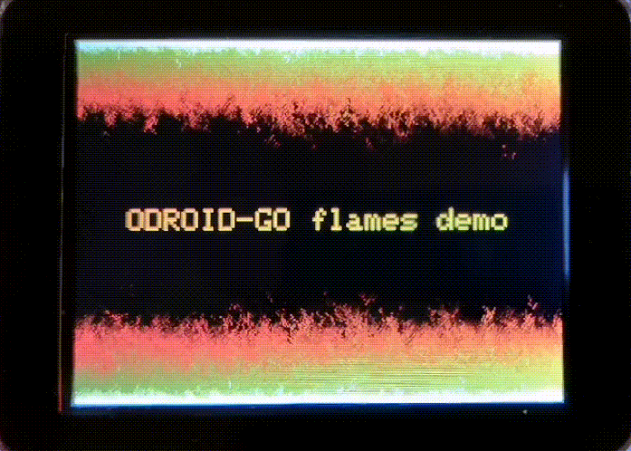

# odroid-flames

That DOOM fire effect on the odroid-go.

This is based on the article [How DOOM fire was done] by Fabien Sanglard.

[How DOOM fire was done]: http://fabiensanglard.net/doom_fire_psx/
